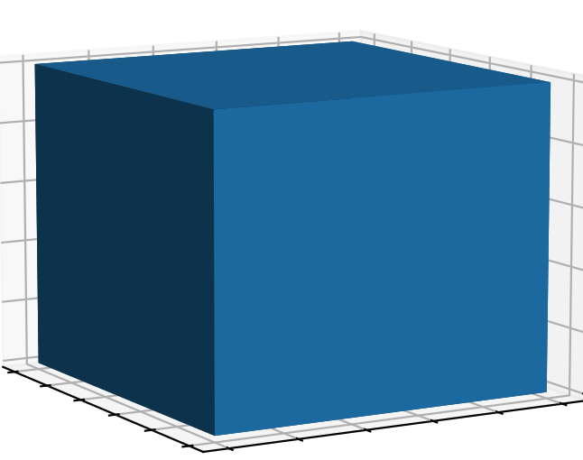
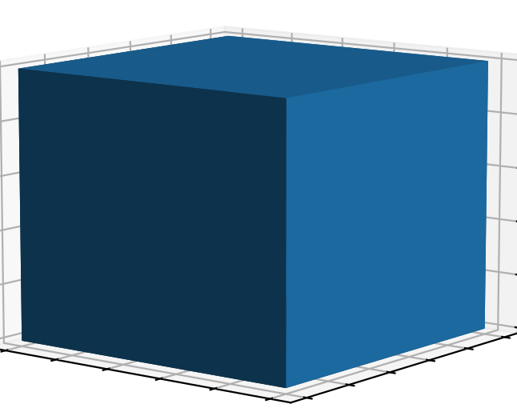
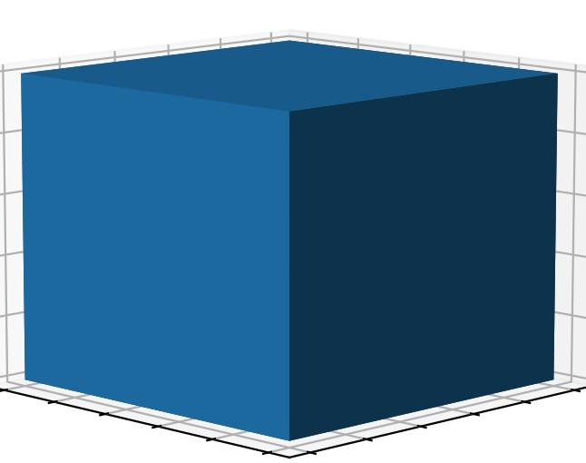
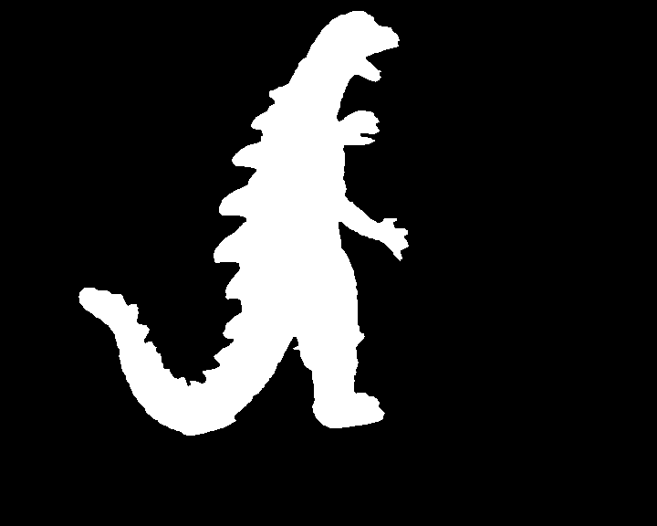
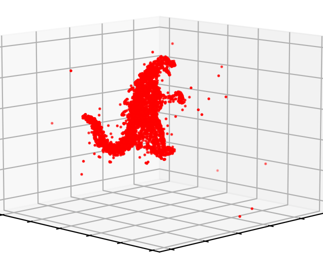

# Space Carving - Octree generation from images

A basic implementation of space carving from [*Automatic 3D Model Construction for Turn-Table Sequences*](https://www.robots.ox.ac.uk/~vgg/publications/1998/Fitzgibbon98a/fitzgibbon98a.pdf) by Fitzgibbon et al.

## Volumetric representation from Octree generation

	

<table>
  <tr>
	 <td></td>
    <td></td>
  </tr>
 </table>

A single cube surrounding every point in the point cloud is used to initialize the octree. The octree is then generated by recursively subdividing into new cubes to a giving depth. Each cube is labeled as entirely inside, entirely outside or intersecting the surface of the object by projecting the cube onto each of the silhouettes. A cube which lies completely outside each silhouette is labeled as entirely outside the object surface and can be discarded. A cube which lies completely inside each silhouette is labeled as entirely inside the object surface and does not need further subdividing. Lastly, a cube intersecting any one of the silhouettes is labeled as intersecting the surface and is kept for further subdividing if higher resolution is desired.

## Data

Images             |  Silhouettes 			|  Point cloud
:-------------------------:|:-------------------------:|:-------------------------:
  |   |  

